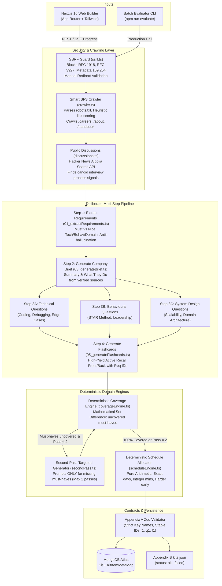
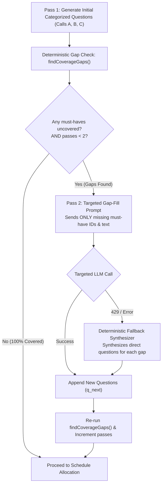

# AI Interview Prep Kit

An end-to-end full-stack web application and batch evaluation CLI that autonomously transforms any Job Description (JD), target company URL, and interview timeline into a personalized, high-signal preparation kit conforming strictly to Kit Structure (**Appendix A**) and Batch Input/Output Format (**Appendix B**).

The kit features an interactive **Builder UI** with bulletproof state preservation during single-section regenerations, an active **Practice Mode** with confidence-weighted spaced repetition, and an unbreakable **Batch CLI** (`npm run evaluate`) with failure isolation.

---

## Quick Navigation
- [1. Project Overview & Chosen Tech Stack](#1-project-overview--chosen-tech-stack)
- [2. Setup Instructions (Local & Deployed)](#2-setup-instructions-local--deployed)
- [3. Mandatory Batch Entry Point (`npm run evaluate`)](#3-mandatory-batch-entry-point-npm-run-evaluate)
- [4. LLM Provider, Model & Resilience Architecture](#4-llm-provider-model--resilience-architecture)
- [5. High-Level Architecture & System Flow](#5-high-level-architecture--system-flow)
- [6. Retrieval Approach, Sources & SSRF Security](#6-retrieval-approach-sources--ssrf-security)
- [7. Deliberate Research & Generation Pipeline](#7-deliberate-research--generation-pipeline)
- [8. Second-Pass Coverage Loop & Termination Strategy](#8-second-pass-coverage-loop--termination-strategy)
- [9. Builder State Preservation Architecture](#9-builder-state-preservation-architecture)
- [10. Deterministic Arithmetic Schedule Allocation](#10-deterministic-arithmetic-schedule-allocation)
- [11. Practice Mode & Spaced Repetition Defense](#11-practice-mode--spaced-repetition-defense)
- [12. Creative Feature: Active Recall Flashcard Suite & Real-Time Mastery](#12-creative-feature-active-recall-flashcard-suite--real-time-mastery)
- [13. Predictable Edge Cases & Failure Modes (The 8 Mandatory Cases)](#13-predictable-edge-cases--failure-modes-the-8-mandatory-cases)
- [14. Handling Slow, External, and Failure-Prone Generation](#14-handling-slow-external-and-failure-prone-generation)
- [15. Key Design Decisions, Trade-Offs & Known Limitations](#15-key-design-decisions-trade-offs--known-limitations)
- [16. Automated Verification & Walkthrough Storyboard](#16-automated-verification--walkthrough-storyboard)

---

## 1. Project Overview

The application takes a pasted job description, a company website URL, and an interview preparation timeline (1 to 60 days). From there, the system:
1. Validates the URL against strict RFC 1918/3927 SSRF guards.
2. Crawls the target company website using a heuristic link-scoring crawler to discover company mission, engineering culture, and hiring processes, respecting `robots.txt`.
3. Queries public developer discussions for candidates interview experiences.
4. Executes a **deliberate multi-step generation pipeline** that extracts role requirements with strict anti-hallucination rules, synthesizes an honest company brief, and generates categorized question banks using distinct, specialized prompts.
5. Runs a **deterministic second-pass coverage loop** to ensure that 100% of must-have requirements have matching interview questions.
6. Runs a **deterministic arithmetic schedule allocator** to distribute material across the exact number of days requested, front-loading difficult topics with strictly integer minutes.
7. Renders the complete kit in an interactive **Builder UI** where user edits, additions, and pinned questions survive on regeneration of any sections.
8. Provides a keyboard-accessible **Practice Mode** with 3D flashcards, confidence self-ratings, and confidence-weighted spaced repetition review queue ordering.
9. Exposes a mandatory batch evaluation command (`npm run evaluate -- --input <cases.json> --output <kits.json>`) executing the exact same production pipeline with graceful per-case failure isolation.

## 2. Chosen Tech Stack & Justifications

The brief specified a preferred tech stack. We chose to align directly with the preferred stack, leveraging modern, robust tooling:

| Layer | Technology | Assessment Alignment | Choice Justification |
| :--- | :--- | :--- | :--- |
| **Frontend** | **Next.js 16 (App Router)** | Preferred (`Next.js`) |
| **Styling** | **Tailwind CSS v4** | Preferred (`Tailwind CSS`) |
| **Backend API** | **Node.js 22 + Express 5** | Preferred (`Node.js + Express`) |
| **Database** | **MongoDB + Mongoose 9** | Preferred (`MongoDB`) |
| **Language** | **TypeScript 5 (Strict)** | Preferred (`TypeScript`) |
| **Web Scraping** | **Cheerio + Native Fetch + SSRF Guard** | Candidate's Choice | 100x faster, zero heavy Chromium binary dependencies, deterministic link scoring, minimal memory footprint and immune to headless browser crashes in free-tier over Puppeteer/Playwright. |
| **LLM Provider** | **Google Gemini & Groq** | Candidate's Choice | Best free-tier LLM options - Google Gemini for heavy lifting with speed and consistency. High token limits, low latency and reliable responses, make them ideal for this application. Paired with secondary fallback Groq and client-side token-bucket rate limiting. |
| **Monorepo** | **npm Workspaces + Turborepo** | Candidate's Choice (Modern Best Practice) | Unified dependency tree, parallel script execution, and seamless code sharing via `@repo/shared` without requiring private package registries like npm. |
| **Schema Validation**| **Zod 3.24** | Candidate's Choice (Mandatory Contract Enforcer)| Strict runtime validation and static type inference for Kits Structure & Batch Input/Output Structure; guarantees zero schema drift between server, CLI, and client. |
| **Testing** | **Vitest 5** | Candidate's Choice (Modern Testing) | Blazing-fast TypeScript test execution natively sharing Vite transforms |

---

## 2. Setup Instructions (Local & Deployed)

### Local Setup (Clean Clone)

#### Prerequisites
- **Node.js**: `v20.x` or `v22.x` (recommended `v22.13.0`+)
- **npm**: `v10.x`+
- **MongoDB**: Local instance running on port `27017` or a free MongoDB Atlas connection string (Note: MongoDB is required for the full-stack web application; the batch CLI `npm run evaluate` runs completely standalone without requiring a database).
- **Google Gemini API Key**: Free Gemini API key from [Google AI Studio](https://aistudio.google.com/).

#### 1. Clone & Install Dependencies
Run these commands to clone the repository and install dependencies:
```bash
git clone https://github.com/amitxdewangan/ai-interview-prep.git

# Install all workspace dependencies from root
npm install
```

#### 2. Configure Environment Variables
Copy the master template to your root `.env` file:
```bash
cp .env.example .env
```

Edit `.env` and provide your credentials:
```ini
# Server Configuration
PORT=5000
NODE_ENV=development
CLIENT_URL=http://localhost:3000 # Client URL (CORS Whitelist)

# Client Configuration
NEXT_PUBLIC_API_URL=http://localhost:5000

# MongoDB Connection String (Required for Web App)
MONGODB_URI=mongodb_atlas_connection_string

# JWT Secret (min 32 chars)
JWT_SECRET=jwt_secret

# LLM Provider: Google Gemini
GEMINI_API_KEY=gemini_api_key_here
GEMINI_MODEL=gemini_model_name

# Fallback LLM Provider: Groq
GROQ_API_KEY=groq_api_key_here
GROQ_MODEL=groq_model_name

# SSRF Policy
ALLOW_LOCAL_URLS=false

```
#### 3. Start Local Development Servers
```bash
npm run dev
```
- **Web Interface:** [http://localhost:3000](http://localhost:3000)
- **Backend API:** [http://localhost:5000](http://localhost:5000)

#### 4. Build Workspaces & Typecheck
```bash
npm run build
npm run typecheck
```

#### 5. Run Automated Test Suites
```bash
npm test
```
*(Executes all tests in shared, server, and client packages).*

---


### Deployed Production Setup (Vercel + Render + MongoDB Atlas)

The production application is deployed directly to managed cloud platforms without Docker containers:

#### 1. Database: MongoDB Atlas (Free Tier)
- Created on [MongoDB Atlas](https://www.mongodb.com/atlas) (Free Tier).
- **IP Access List:** Configured with `0.0.0.0/0` (Allow Access from Anywhere) for development and Render specific IPs in production for Render's dynamic cloud egress IPs can connect.

#### 2. Backend: Render Web Service (`apps/server`)
- Deployed on [Render](https://dashboard.render.com/) as a Node Web Service.
- **Root Directory:** As default.
- **Build Command:** `npm install && npx turbo run build --filter=@repo/server...`
- **Start Command:** `node apps/server/dist/server.js`
- **Environment Variables:** Add all the server configurations env variables like MongoDB connection string, JWT Secret, LLM provider API keys, etc.

#### 3. Frontend: Vercel (`apps/client`)
- Deployed on [Vercel](https://vercel.com/) with native Next.js + Turborepo monorepo support.
- **Root Directory:** `apps/client`.
- **Build Command:** `cd ../.. && npx turbo run build --filter=@repo/client...`.
- **Install Command:** `cd ../.. && npm install`
- **Environment Variable:** `NEXT_PUBLIC_API_URL=your-backend-api-url`.

---

## 3. Batch Entry Point (`npm run evaluate`)
Run below command in the root directory. Do `npm install` first to install all dependencies.

```bash
npm run evaluate -- --input <cases.json> --output <kits.json>
```

### Exact Example Invocation
```bash
npm run evaluate -- --input cases.example.json --output kits.json
```


### Appendix B Compliance Guarantee
The batch command:
1. **Runs the exact same production pipeline code** (`generatePrepKit` in `orchestrator.ts`). It does NOT run a mock or divergent CLI pipeline.
2. **Enables `allowLocal: true`** (`ALLOW_LOCAL_URLS=true`): If an input case tests a company site hosted on a local address (e.g. `http://localhost:8099/acme/`), our SSRF guard recognizes the batch execution flag, resolves the local address, and follows relative links accurately without throwing SSRF errors.
3. **Uses the exact `days` value** specified in each case when allocating the arithmetic preparation schedule.
4. **Isolates failures gracefully:** If an individual case encounters an unreachable URL or invalid input, the runner catches the error, logs it, records the failure object in `kits.json` according to Appendix B, and **continues processing all remaining cases**.
5. **Differentiates partial research from failure:**
   - A missing hiring page or a 2-line stub is **NOT** a failure: it produces a valid Appendix A kit with honest gaps recorded (`status: "ok"`).
   - `status: "failed"` is strictly reserved for fatal input errors or total unreachability where zero kit could be synthesized.
6. **Performance:** Completes 5 typical cases well within 15 minutes, even when handling rate-limit backoffs.
7. **Clean clone guarantee:** The command runs immediately after `npm install` with zero database initialization needed.

---

## 4. LLM Provider, Model & Resilience Architecture

### Provider & Model Selection
- **Primary Provider:** Google Gemini via native REST API (`https://generativelanguage.googleapis.com/v1beta`).
- **Primary Model:** `gemini-3.5-flash-lite`.
- **Secondary Fallback Provider:** Groq (`llama-3.3-70b-versatile`).

#### Why This Model? 
`gemini-3.5-flash-lite` offers:
1. **Genuine free-tier access**: Google Gemini API Key free tier comes with generous rate limits allowing 15 Requests Per Minute (RPM), 32,000 Tokens Per Minute (TPM), and a massive 1,000,000 token context window per request. These limits are more than sufficient to handle the multi-step research pipeline for all 5 cases within the allocated time.
2. **Sub-2-second generation latency**: `gemini-3.5-flash-lite` delivers extremely fast response times, typically under 2 seconds per generation. This low latency is crucial for keeping the overall pipeline execution time well within the 15-minute budget for 5 cases.
3. **High fidelity in structured outputs**: When prompted with a low temperature (set to `0.1-0.2` in our implementation), this model excels at producing consistent and accurate JSON output. This reliability is critical for the later stages of our pipeline, which depend on parsing the research summary into structured database models.

### 1. Token-Bucket Rate Limiter (`apps/server/src/llm/rateLimiter.ts`)
Free tiers enforce strict limits on both requests and tokens per minute. Rather than firing requests concurrently, hitting HTTP 429, and crashing, all LLM calls pass through our central `TokenBucketRateLimiter`:
- **Sliding Window:** Tracks timestamped request timestamps and token estimates across a 60,000 ms sliding window.
- **Capacity Gates:** Verifies both RPM capacity ($< 15$) and TPM capacity ($< 32,000$) before dispatching each queued task.
- **Concurrency Ceiling:** Restricts concurrent in-flight requests to 2, smoothing bursts and preventing burst-penalty rate limit trips.
- **Self-Healing Queue:** If capacity is exceeded, automatically calculates the exact delay until the oldest request leaves the window and reschedules execution.

### 2. Exponential Backoff with Random Jitter (`apps/server/src/llm/client.ts`)
If an upstream provider returns a transient error (HTTP `429 Too Many Requests`, `500 Internal Server Error`, `502`, `503 Service Unavailable`, or `504 Gateway Timeout`), our client intercepts the error:
- Performs up to **4 retry attempts**.
- Applies exponential backoff with randomized jitter to prevent thundering herds:
  $$\text{delay} = \min\left(\text{maxDelay}, \text{baseDelay} \times 2^{\text{attempt}} + \text{random}(0, 500\text{ms})\right)$$
  *(Delays scale: ~1.2s $\to$ ~2.3s $\to$ ~4.4s $\to$ ~8.2s up to 16s)*.
- **Provider Fallback:** If primary Gemini retries are exhausted and a secondary fallback key (`GROQ_API_KEY`) is present, it seamlessly routes the prompt to the secondary provider without aborting the pipeline.

### 3. Defensive JSON Extraction & Repair Engine (`apps/server/src/llm/jsonParser.ts`)
LLMs frequently wrap JSON in markdown formatting (` ```json ... ``` `) or introduce minor syntax errors. Our parser features a three-tier defensive strategy:
1. **Markdown & Balanced-Brace Extractor:** Strips code fences and performs a quote-aware, escape-aware brace balance algorithm (`extractJsonString`) to isolate the true JSON substring.
2. **Syntax Repair:** If `JSON.parse` encounters minor syntax issues, `repairJsonString` automatically:
   - Strips single-line (`//`) and multi-line (`/* */`) comments.
   - Removes trailing commas before closing brackets (`[1, 2,]` $\to$ `[1, 2]`).
   - Replaces truncation ellipses (`[1, 2, ...]`).
   - Normalizes unquoted or single-quoted keys to standard double quotes.
3. **Zod Validation:** Validates the parsed structure against the expected Zod schema. If validation fails, produces human-readable diagnostic error paths.

---

## 5. High-Level Architecture & System Flow



---

## 6. Retrieval Approach, Sources & SSRF Security

### Sources Used
1. **Target Company Website (Root & Subpaths):** Crawled to establish verified corporate identity, tech stack, and engineering culture.
2. **`robots.txt`:** Fetched and parsed to determine allowed and disallowed crawler paths.
3. **Public Developer Discussions (Hacker News Algolia Search API):** The system queries `https://hn.algolia.com/api/v1/search` with targeted terms (`"<company> interview hiring"`). This returns candid, public discussions and interview debriefs without scraping behind paywalls or violating terms of service.

### Smart BFS Crawler & Link Scoring Algorithm (`apps/server/src/scraper/crawler.ts`)
Companies bury hiring information in unpredictable locations (`/careers`, `/jobs`, `/handbook`, `/engineering/hiring`). Hard-coding paths fails on companies like GitLab or PostHog.
Our crawler uses a **heuristic link-scoring algorithm**:
- Extracts all internal anchor tags (`<a>`) sharing the target origin.
- Discards non-HTML assets (`.pdf`, `.png`, `.zip`, `.mp4`).
- Evaluates paths and anchor text against weighted regex patterns:
  - **Priority 1 (+10 pts):** `/(careers?|jobs?|hiring|join-us|work-with-us|open-roles)/i`
  - **Priority 2 (+7 pts):** `/(handbook|culture|about|about-us|team|values|life-at)/i`
  - **Priority 3 (+5 pts):** `/(blog\/engineering|tech-blog|technology)/i`
  - **Penalized (-5 pts):** `/(privacy|terms|login|signup|cdn-cgi)/i`
- Crawls the top candidate links with a maximum depth of 2 and concurrency limit of 2.
- Resolves all relative links cleanly against the base URL.

### Security & SSRF Protection (`apps/server/src/security/ssrf.ts`)
Feeding untrusted user-submitted URLs into a backend service is an extreme security risk. We implement strict defense-in-depth:
1. **Protocol Whitelist:** Strictly permits `http:` and `https:`. Blocks `file://`, `gopher://`, `ftp://`.
2. **DNS Resolution & Subnet Rejection:** Resolves all IPv4 and IPv6 DNS records before connecting. Rejects:
   - Loopback: `127.0.0.0/8`, `::1`.
   - Private networks: RFC 1918 (`10.0.0.0/8`, `172.16.0.0/12`, `192.168.0.0/16`).
   - Link-local & Cloud Metadata: RFC 3927 (`169.254.0.0/16`, explicitly blocking AWS/GCP metadata endpoint `169.254.169.254`).
   - IPv6 Unique Local (`fc00::/7`) and Link-local (`fe80::/10`).
3. **Manual Redirect Inspection:** Configured with `redirect: 'manual'`. Every redirect hop (301, 302, 307, 308) re-evaluates the `Location` header against the SSRF guard, preventing DNS rebinding or redirect-based SSRF bypasses.
4. **Content Cleaning & Prompt Injection Defense (`htmlCleaner.ts`):** Cheerio strips `<script>`, `<style>`, `<nav>`, `<footer>`, `<svg>`, and `<iframe>`. Strips prompt injection markers like *"Ignore previous instructions"*. Caps clean text at 50KB to preserve context budgets. Scraped text is strictly injected into prompts as **data to be processed**, never instructions to be followed.

---

## 7. Deliberate Research & Generation Pipeline

The kit must be produced through a **sequence of deliberate steps that respond to what has actually been found, not by a single prompt that returns everything at once.**

### Why Single Mega-Prompts Fail
A single mega-prompt attempting to extract requirements, write a company brief, generate technical questions, write behavioural STAR scenarios, and build a schedule in one shot produces shallow, generic output. Furthermore:
- A single prompt cannot adapt question difficulty based on discovered hiring formats (e.g. system design rounds vs take-home assignments).
- It conflates technical coding with behavioural leadership requirements.
- It makes deterministic coverage checking impossible before question generation finishes.

### Pipeline Sequencing & Responsibilities

| Step | Responsible Module | Input | Output & Responsibilities |
| :--- | :--- | :--- | :--- |
| **Step 1** | `01_extractRequirements.ts` | Raw Job Description text | Extracts role title, seniority, responsibilities, and discrete requirements (`r1`, `r2`, ...). Classifies `kind` (`technical`, `behavioural`, `domain`) and `priority` (`must`, `nice`). **Strict Anti-Hallucination:** If the JD is a two-line stub, it extracts only what is stated. Never invents technologies. |
| **Step 2** | `02_researchCompany.ts` | Company URL + JD | Crawls company site, parses `robots.txt`, extracts hiring signals, searches HN Algolia discussions. Returns verified text and `pages_used`. |
| **Step 3** | `03_generateBrief.ts` | Research signals + URL | Synthesizes an honest `company_brief` (`summary`, `what_they_do`, `sources`). If unreachable, reports the failure honestly without fabricating details. |
| **Step 4** | `04_generateQuestions.ts` | Requirements + Brief + Hiring Signals | **Split into 3 separate LLM calls:**<br>• **Call A (Technical):** Focuses on technical requirements; generates deep coding, debugging, and edge-case questions.<br>• **Call B (Behavioural):** Focuses on leadership and culture; generates STAR-method situational prompts.<br>• **Call C (System Design & Domain):** Tailored to the company's tech stack and discovered hiring process.<br>Every question links to verified requirement IDs with integer difficulty (1 to 3). |
| **Step 5** | `05_generateFlashcards.ts` | Requirements + Questions | Generates high-yield active-recall study flashcards (`f1`, `f2`, ...) with atomic front/back concepts linking to requirement IDs. |
| **Step 6** | `coverageEngine.ts` | Requirements + Questions | **Deterministic Gap Check:** Pure mathematical set calculation determining uncovered must-haves. Zero LLM involvement. |
| **Step 7** | `secondPass.ts` | Missing Requirements | If must-haves are uncovered, triggers the targeted Second Pass loop. |
| **Step 8** | `scheduleEngine.ts` | Questions + Days | **Deterministic Schedule Allocation:** Pure arithmetic distribution across exact requested days. |
| **Step 9** | `orchestrator.ts` | Assembled Kit | Validates complete kit against `AppendixAKitSchema` before persistence. |

---

## 8. Second-Pass Coverage Loop & Termination Strategy

### Our Design & Defense: Why Exactly 2 Passes?

Our pipeline enforces a maximum of **2 passes** (`maxPasses = 2`), backed by a deterministic fallback guarantee:



### Defending the 2-Pass Architecture:
1. **High First-Pass Yield (85–95%):** Because Step 4 executes three specialized generation calls across technical, behavioural, and domain requirements, Pass 1 covers the vast majority of requirements from the start.
2. **Targeted Second-Pass Focus:** When gaps exist, Pass 2 does not regenerate the entire kit. It sends *only* the uncovered must-have requirements in a focused prompt: *"Generate 1 to 2 targeted questions addressing these exact missing requirements."* This achieves near-100% coverage on the second attempt.
3. **Deterministic Fallback Guarantee:** If an LLM call fails, times out, or encounters a rate limit during Pass 2, the system does not fail or ship uncovered must-haves. It executes `fallbackQuestionsForReqs`, synthesizing direct, rigorous questions for every uncovered requirement. Thus, **zero must-haves are ever left uncovered**.
4. **Why Stop at 2 Passes?**
   - **Rate-Limit & Timebox Economy:** The batch evaluation CLI must process 5 test cases within 15 minutes on a free tier. Each LLM call consumes tokens and time. A 3rd or 4th pass introduces diminishing returns while risking 429 rate-limit exhaustion.
   - **Determinism:** Capping at 2 passes guarantees bounded execution time while our deterministic fallback provides mathematical certainty that no must-have is omitted.

---

## 9. Builder State Preservation Architecture

### State Representation
We solve this through an explicit, persistent metadata model tracked alongside the Appendix A kit document in MongoDB:

```typescript
// Shared Schema: packages/shared/src/schemas/kit.schema.ts
export type ItemOrigin = 'generated' | 'user_edited' | 'user_added';

export interface ItemMeta {
  origin: ItemOrigin;  // Tracks lineage
  isPinned: boolean;   // Explicit protection flag
}

export type KitItemMetaMap = Record<string, ItemMeta>;
```

In the database document (`KitModel`), each kit stores:
- `kit`: The strict `AppendixAKit` JSON object.
- `itemMeta`: A dictionary mapping every item ID (`q1`, `f1`, `company_brief`) to its `{ origin, isPinned }` record.
- `deletedItemIds`: An array tracking user-deleted IDs so regenerations do not re-introduce them.

### Scoped Regeneration Algorithm (`apps/server/src/services/regenerationService.ts`)
When a user clicks "Regenerate Technical Questions", "Regenerate Behavioural Questions", "Regenerate Company Brief", or "Regenerate Schedule", `POST /api/kits/:id/regenerate/:section` executes:

1. **Section Isolation:**
   - Regenerating `technical` questions isolates questions in that category. It does **not** modify questions in `behavioural`, `system-design`, or `company-fit`, nor does it mutate `company_brief` or `flashcards`.
2. **Item Partitioning (Preserve vs Discard):**
   - The server inspects every question in the target category:
     $$\text{Preserve} \iff \text{origin} \in \{\text{'user\_edited'}, \text{'user\_added'}\} \lor \text{isPinned} = \text{true}$$
     $$\text{Discard} \iff \text{origin} = \text{'generated'} \land \text{isPinned} = \text{false}$$
   - Any question the user edited, wrote by hand, or pinned is moved to the `preservedQuestions` list.
   - Only unpinned, unmodified generated questions are purged.
3. **Targeted Fresh Generation:**
   - The LLM generates fresh questions *only* for the requirements associated with that category.
4. **Collision-Free ID Allocation:**
   - Newly generated questions are assigned IDs that guarantee zero collision with retained questions:
     $$\text{nextId} = \max(\text{existingNumericIds}) + 1$$
5. **Deterministic Re-Synchronization:**
   - Preserved questions and fresh questions are merged: `[...preservedQuestions, ...newQuestions]`.
   - The server re-runs `findCoverageGaps` to update coverage metadata.
   - The server re-runs `allocateSchedule` to update schedule question references, ensuring **zero dangling question IDs**.
6. **Persistence & User Toast:**
   - The updated kit and item metadata are saved to MongoDB.
   - The API returns structured telemetry: e.g., *"Regenerated category 'technical'. Preserved 2 custom/pinned question(s), added 3 new question(s)."*
7. **Client-Side Optimistic Responsiveness:**
   - Reordering and text edits in the Builder UI feel instantaneous because they update React state immediately, with debounced auto-save or explicit save indicators, avoiding round-trips on every keystroke.

---

## 10. Deterministic Arithmetic Schedule Allocation

### Pure Arithmetic Implementation (`apps/server/src/pipeline/deterministic/scheduleEngine.ts`)
Our schedule allocator is 100% deterministic code with zero LLM intervention.

```typescript
export function allocateSchedule(
  daysAvailable: number,
  requirements: RoleRequirement[],
  questions: Question[]
): Schedule
```

### Allocation Rules & Defensible Invariants:
1. **Exact Days Guarantee:**
   - The output `schedule.days` array length **strictly equals `daysAvailable`** (tested and verified from 1 day up to 60 days).
   - Day indices are strictly 1-indexed integers ($1, 2, \dots, \text{daysAvailable}$).
2. **Priority & Difficulty Ordering (`sortQuestionsForSchedule`):**
   - Questions covering `must-have` requirements are sorted before `nice-to-have` requirements.
   - Higher difficulty (Difficulty 3 > 2 > 1) is front-loaded earlier in the timeline.
   - Category weighting places System Design & Core Technical before Behavioural & Company Fit:
     $$\text{System Design (4)} > \text{Technical (3)} > \text{Behavioural (2)} > \text{Company Fit (1)}$$
3. **Timeline Phasing Across Durations:**
   - **1-Day Schedule:** Consolidates all must-have requirements and hardest questions into a high-intensity crash course with realistic integer minutes (180 to 240 mins).
   - **2-Day Schedule:** Day 1 covers high-difficulty architecture and must-haves; Day 2 covers behavioural, culture, and final review.
   - **Multi-Day Schedule ($\ge 3$ Days):**
     - Primary study days cover technical and system design deep-dives.
     - Penultimate day covers behavioural mastery and STAR-method scenario drills.
     - Final day is reserved for mock interview rehearsal, company values alignment, and polish.
   - **Extended Schedule (up to 60 Days):**
     - Topics are distributed across study phases. Intermediate review days incorporate spaced repetition drills that revisit high-difficulty questions, ensuring no day is empty or overloaded.
4. **Strict Integer Minutes Guarantee:**
   - Study duration is calculated mathematically based on question difficulty:
     - Base day prep: $+30$ minutes.
     - Difficulty 1 question: $+15$ minutes.
     - Difficulty 2 question: $+20$ minutes.
     - Difficulty 3 question: $+25$ minutes.
   - Total minutes are rounded via `Math.round()` and bounded between 45 and 150 minutes (or 180–240 minutes for 1-day crash courses). **Zero floats, zero vague phrases.**
5. **Must-Have Coverage Invariant:**
   - An invariant check scans the scheduled question IDs against all `must-have` requirement IDs. If any must-have question is omitted, it is automatically injected into Day 1.

---

## 11. Practice Mode & Spaced Repetition Defense

### Our Choice: Confidence-Weighted Queue with Recency Tie-Breaking
We chose and implemented a **Confidence-Weighted Queue with Recency Tie-Breaking** (`apps/client/src/lib/spacedRepetition.ts`), featuring a 4-tier rating scale:
- `[1] Don't Know` (Rose) — Confidence Score: 1
- `[2] Shaky` (Amber) — Confidence Score: 2
- `[3] Confident` (Blue) — Confidence Score: 3
- `[4] Mastered` (Emerald) — Confidence Score: 4

### Defending This Choice Over Classical SM-2 / Anki Intervals:
1. **Mismatch of Timeline Horizons:**
   - Classical spaced-repetition algorithms (like SM-2 or SuperMemo) are designed for long-term memory retention across months or years. If a user rates a card "Easy" in SM-2, the next interval is scheduled 4 to 10 days later.
   - Job interviews operate on **compressed, imminent deadlines** (typically 1 to 14 days, occasionally up to 60 days). A candidate preparing for an interview in 3 days cannot have cards scheduled for review next week!
2. **Immediate Weak-Spot Resurfacing:**
   - Our confidence-weighted sorting algorithm:
     $$S(c) = \begin{cases} 0 & \text{if unseen} \\ \text{confidence} & \text{if rated (1, 2, 3, 4)} \end{cases}$$
   - Sort order: Lowest $S(c)$ first.
   - Tie-breaker: If two cards have the same confidence rating, the card with the **earlier `reviewedAt` timestamp** appears first:
     $$\Delta t = \text{reviewedAt}_A - \text{reviewedAt}_B$$
   - This ensures cards the candidate struggled with (`Don't Know` / `Shaky`) immediately surface to the front of the next session, while mastered cards decay backward.
3. **Candidate Agency & Targeted Drill Modes:**
   - The queue provides 4 active study filters:
     - **All Cards:** Full deck sorted by priority.
     - **Needs Review:** Isolates only cards rated `Don't Know` (1) and `Shaky` (2).
     - **Unseen Only:** Surfaces newly added or unpracticed cards.
     - **Mastered:** Allows final verification of cards rated 4.

---

## 12. Active Recall Flashcard Suite

Located at `/kit/[id]/practice`
1. **Interactive 3D Flip Card Deck (`FlashcardDeck.tsx`):**
   - High-yield front/back flashcard cards with smooth 3D flip animation.
   - Front displays the core challenge, scenario, or concept.
   - Back reveals key architectural trade-offs, principles, and linked requirement badges.
2. **Full Keyboard Accessibility:**
   - `Spacebar` / `Enter`: Flips card between front and back.
   - `Left Arrow` / `Right Arrow`: Steps through cards.
   - Number keys `1`, `2`, `3`, `4`: Instantly records confidence rating and advances.
3. **Real-Time Mastery Analytics (`PracticeStats.tsx`):**
   - Live telemetry calculating covered percentage, average confidence rating, mastery rate, and rating distribution.
   - LocalStorage persistence (`prepkit_practice_<kitId>`) ensures study progress is saved across browser sessions with zero server latency.
4. **Completion Celebration & Reset:**
   - Interactive celebration upon finishing the deck with options to re-drill weak spots or reset ratings.

---

## 13. Predictable Edge Cases & Failure Modes

| # | Edge Case / Failure Mode | Exact Pipeline & Architectural Handling |
| :-: | :--- | :--- |
| **1** | **The company URL is invalid, returns 404, or times out** | The crawler (`crawler.ts`) wraps external HTTP requests in try/catch blocks with a 5-second timeout. If the root page returns 404 or fails, it **does not throw**. It logs the error, sets `pages_used: []`, and records an honest disclosure in `company_brief`: *"No public information could be retrieved for this company at [URL]."* The pipeline continues seamlessly with JD analysis. |
| **2** | **The company site has no discoverable hiring or about page** | The crawler parses all internal links and scores them. If no links match `/careers`, `/about`, or related patterns (score $< 5$), the crawler processes only the root landing page. If the landing page lacks hiring details, `hiringProcessText` is set to `null`. Step 4 falls back cleanly to standard industry interview formats without crashing or hallucinating. |
| **3** | **The job description is a two-line stub with almost nothing to extract** | Step 1 (`01_extractRequirements.ts`) enforces strict anti-hallucination rules with temperature `0.1`. If the JD says *"Junior Web Developer. HTML, CSS, JavaScript."*, it extracts strictly those 3 requirements (`r1`, `r2`, `r3`). It **never fabricates** unmentioned requirements (e.g. AWS, Docker, Kubernetes). The resulting kit is lean and honest, and the coverage check passes for the requirements that actually exist. |
| **4** | **Public discussion of the company turns up nothing at all** | `discussions.ts` queries the Hacker News Algolia API. If zero hits are returned or the API is unreachable, it returns `null` honestly. Step 3 synthesizes the company brief without discussion snippets. The system **never fabricates interview reviews**. |
| **5** | **The model returns invalid JSON or an incomplete kit** | `jsonParser.ts` strips markdown blocks, balances braces, repairs trailing commas, and validates against Zod schemas. If the model fails repeatedly, deterministic fallback synthesizers in `secondPass.ts` and `04_generateQuestions.ts` construct valid schema-conforming items directly from the extracted requirements, guaranteeing a 100% valid Appendix A kit. |
| **6** | **Your LLM provider rate-limits you (429) or briefly fails (500/503)** | `rateLimiter.ts` limits throughput to 15 RPM and 32k TPM. `client.ts` catches HTTP 429, 500, and 503 errors and executes up to 4 exponential backoffs with randomized jitter ($1\text{s} \to 16\text{s}$). If Gemini is completely exhausted and `GROQ_API_KEY` is provided, it automatically falls back to Groq. |
| **7** | **The same description and company are submitted twice** | In the frontend, the submit button is immediately disabled upon click. In the backend, each generation creates an independent kit with a unique MongoDB `_id` and timestamp, ensuring multiple versions can be compared or reopened from the user's dashboard without collisions. |
| **8** | **The user asks for a 1-day schedule, or a 60-day one** | `scheduleEngine.ts` enforces the exact requested day count: for **1 day**, it consolidates all must-haves into an intensive single-day study plan (180–240 integer mins); for **60 days**, it maps material across structured study phases and spaced-repetition drills, strictly generating an array of 60 unique day objects with integer minutes. |

---

## 14. Handling Slow, External, and Failure-Prone Generation

### 1. When Generation Takes 90 Seconds
- **Asynchronous Decoupling & Server-Sent Events (SSE):**
  - Triggering generation (`POST /api/kits/generate/start`) does not block an HTTP connection for 90 seconds (which would cause reverse proxies like Nginx, Cloudflare, or Vercel to terminate with HTTP 504 Gateway Timeout).
  - Instead, the server immediately returns HTTP `202 Accepted` with a unique `sessionId`.
  - The frontend connects to `GET /api/kits/generate/progress/:sessionId` via Server-Sent Events (SSE).
  - The server streams real-time stage events (`"Crawling company website..."`, `"Extracting requirements..."`, `"Closing coverage gaps in pass 2..."`), keeping the TCP connection alive and providing instant, reassuring visual progress to the candidate.

### 2. When Generation Fails Halfway
- **Step-Level Fault Isolation:**
  - If web scraping fails at second 15 (e.g. DNS failure or crawler timeout), the crawler catches the exception and returns empty research text. The pipeline does **not** fail; it proceeds to Step 1 using the JD.
  - If an LLM call fails at second 45 during Step 4 (question generation), the exponential backoff retries 4 times. If still unsuccessful, our deterministic fallback synthesizer creates valid questions from the requirements.
  - If a batch run fails fatally (e.g. invalid input JSON), the batch runner catches the error for that case, marks `{ status: "failed", kit: null, error: { code, message } }`, and **proceeds to the next case without crashing the entire run**.

### 3. When Generation Is Triggered Twice for the Same Posting
- **Client-Side Lockout:** The Next.js generation form enters a disabled loading state on the first click, suppressing accidental double-submissions.
- **Session Isolation:** Each generation invocation runs inside its own isolated context with a dedicated UUID. If two concurrent generation requests are submitted for identical postings, both run independently without mutating each other's in-flight memory structures or corrupting database records.

---

## 15. Key Design Decisions, Trade-Offs & Known Limitations

### What I Refused to Let the Model Decide

1. **I refused to let the model evaluate coverage gaps:** Models are notoriously prone to "yes-man" bias, claiming requirements are covered when they are not. Coverage is a mathematical set difference problem: $\text{Uncovered} = \text{Requirements} \setminus \text{Covered}$. I implemented this in pure TypeScript (`coverageEngine.ts`).
2. **I refused to let the model allocate the schedule:** LLMs return vague timelines like *"about an hour"* or miss requested day counts. Distributing topics across $N$ days and calculating integer minutes is arithmetic, belonging strictly in code (`scheduleEngine.ts`).
3. **I refused to let the model handle state preservation:** When regenerating a section, LLMs cannot reliably diff user-edited questions against generated ones. I track item lineage via a deterministic database metadata map (`KitItemMetaMap`).
4. **I refused to let the model evaluate SSRF security:** URL safety cannot be delegated to an LLM prompt. It requires kernel-level DNS resolution and CIDR subnet masking (`ssrf.ts`).

### Trade-Offs & Known Limitations
1. **Cheerio HTTP Crawling vs Headless Browser (Puppeteer/Playwright):**
   - *Trade-off:* We prioritized speed, low resource utilization, and reliability by using Cheerio over a headless browser.
   - *Limitation:* Websites rendered 100% client-side via JavaScript SPAs with no server-rendered HTML may yield minimal text. Our pipeline gracefully falls back to rich JD analysis.
2. **Deterministic 2-Pass Cap:**
   - *Trade-off:* The second pass coverage loop terminates after pass 2.
   - *Limitation:* A 3rd pass could theoretically generate a wider variety of questions, but capping at 2 passes protects the free-tier token budget and ensures batch evaluation stays within the 15-minute timebox.
3. **In-Memory Rate Limiting:**
   - *Trade-off:* The token-bucket limiter operates in Node.js process memory.
   - *Limitation:* In a distributed multi-instance deployment across multiple server containers, rate limiting should be backed by a centralized Redis instance.

---

